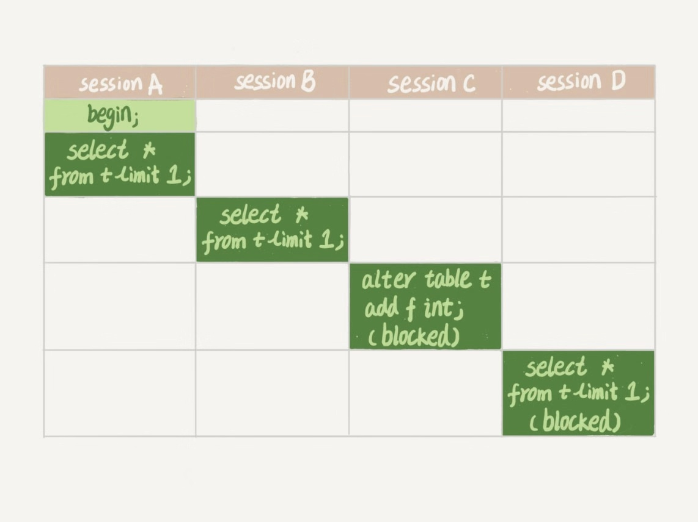

# 6.全局锁和表锁

* 数据库中的锁涉及的初衷是解决并发问题，锁控制多用户并发访问资源。
* 锁根据范围分为全局锁，表级锁，行级锁。

### 6.1 全局锁

* 对整个db实例加锁。mysql提供了一个flush tables with read lock（ftwrl）的方法来加全局锁。使用后整个库处于只读，DML，DDL都不能执行。
* 使用的场景就是做全库的逻辑备份，也就是把每个表都select出来，存成文本。想想备份为什么要加锁：不加锁的话，有写入的情况会叫备份的数据有问题，恢复出来的数据异常。
* 但是叫整个库都处于只读，很危险：
  * 在主库上，业务无法写入
  * 在备库上，备库此时无法同步主库的binlog，产生主备延迟。
* 但是，只要在备份的时候，可以拿到一个一致性视图就可以不用加全局锁了。在可重复读的隔离级别中开启一个事务就可以获取一个一致性视图。官方的逻辑备份工具mysqldump提供single-transaction的时候，在导数据前会启动一个事务，来确保拿到全局一致性视图，由于MVCC的支持，这个过程中数据可以正常跟新。但是有这个工具的功能，为什么还要FTWRL，应为某些引擎不支持事务。
* 要设置只读可以使用set global readonly = true就行，为什么还是建议使用FTWRL
  * 有些系统中通过readonly来判断主机还是备机，这样修改会产生影响。
  
    异常处理有差异。FTWRL在客户端发生异常断开，MySQL会自动释放这个全局锁，但是readonly变量不会。

### 6.2 表级锁

* 表锁分为两种：表锁，元数据锁

#### 6.2.1 表锁

* 通过 lock table … read / write来加锁，于FTWRL一样可以使用unlock tables主动释放，也可在客户端断开的时候主动释放。注意，lock table 不仅会限制其他线程的操作，本线程操作也会有影响：
  * 线程A给T1 加 read 锁，给T2加write锁
  * 其他线程写T1和读T2会被阻塞
  * 线程A在unlock tables之前也只能读T1，写T2
* 没有更细粒度的锁出现前，表锁是常用的并发控制的方式，相比innodb支持行锁，这个粒度还是太大

#### 6.2.2 元数据锁（meta data lock MDL）

* MDL不需要显示的指定，在访问一个表的时候，自动加上。

* 作用是保证读写正常：如果一个查询遍历表中的数据，另一个线程修改表结构，删除一行，那么查询线程拿到的数据和表结构不一致。因此：mysql5.5加入MDL。对表增删改查是加MDL读锁，在DDL时加DML写锁：
  * 读锁之间不互斥，可以多个线程对同一张表增删改查
  * 读写锁之间，写锁之间互斥。用来保证表结构操作的安全。因此两个线程DDL时，一个要等待一个结束。
  
* 虽然MDL是默认加的，但是不注意，给一个小表加字段会导致整个库挂掉：

	* 如图：
	* 我们可以看到 session A 先启动，这时候会对表 t 加一个 MDL 读锁。由于 session B 需要的也是 MDL 读锁，因此可以正常执行。之后 session C 会被 blocked（阻塞），是因为 session A 的 MDL 读锁还没有释放，而 session C 需要 MDL 写锁，因此只能被阻塞。如果只有 session C 自己被阻塞还没什么关系，但是之后所有要在表 t 上新申请 MDL 读锁的请求也会被 session C 阻塞。前面我们说了，所有对表的增删改查操作都需要先申请 MDL 读锁，就都被锁住，等于这个表现在完全不可读写了。
	* 如果某个表上的查询语句频繁，而且客户端有重试机制，也就是说超时后会再起一个新 session 再请求的话，这个库的线程很快就会爆满。
	* 你现在应该知道了，事务中的 MDL 锁，在语句执行开始时申请，但是语句结束后并不会马上释放，而会等到整个事务提交后再释放。
	
*  如何给小表加一列呢？
   *  首先我们要解决长事务，事务不提交，就会一直占着 MDL 锁。在 MySQL 的 information_schema 库的 innodb_trx 表中，你可以查到当前执行中的事务。如果你要做 DDL 变更的表刚好有长事务在执行，要考虑先暂停 DDL，或者 kill 掉这个长事务。
   *  但考虑一下这个场景。如果你要变更的表是一个热点表，虽然数据量不大，但是上面的请求很频繁，而你不得不加个字段，你该怎么做呢？
   *  这时候 kill 可能未必管用，因为新的请求马上就来了。比较理想的机制是，在 alter table 语句里面设定等待时间，如果在这个指定的等待时间里面能够拿到 MDL 写锁最好，拿不到也不要阻塞后面的业务语句，先放弃。之后开发人员或者 DBA 再通过重试命令重复这个过程。
   *  MariaDB 已经合并了 AliSQL 的这个功能，所以这两个开源分支目前都支持 DDL NOWAIT/WAIT n 这个语法。
   
   * ```sql
     ALTER TABLE tbl_name NOWAIT add column ...
     ALTER TABLE tbl_name WAIT N add column ...
     ```

#### 6.2.3 小结

* 全局锁主要用在逻辑备份过程中。对于全部是 InnoDB 引擎的库，我建议你选择使用–single-transaction 参数，对应用会更友好。
* 表锁一般是在数据库引擎不支持行锁的时候才会被用到的。如果你发现你的应用程序里有 lock tables 这样的语句，你需要追查一下，比较可能的情况是：
  * 要么是你的系统现在还在用 MyISAM 这类不支持事务的引擎，那要安排升级换引擎；
  * 要么是你的引擎升级了，但是代码还没升级。我见过这样的情况，最后业务开发就是把 lock tables 和 unlock tables 改成 begin 和 commit，问题就解决了。
* MDL 会直到事务提交才释放，在做表结构变更的时候，你一定要小心不要导致锁住线上查询和更新。
* online ddl的过程

  *  1拿DML写锁
  *  2降级成MDL读锁
  *  3做ddl
  *  4升级成DML写
  *  5释放DML
* 如果 1、2、4、5不冲突，执行时间很短，3占用时间很长，这个几千可以有正常读写，因此成为online
* 全库只读在slave上，如果slave上，如果用户有超级权限，那么readonly失效
* MDL是为了防止DDL和DML并发冲突
