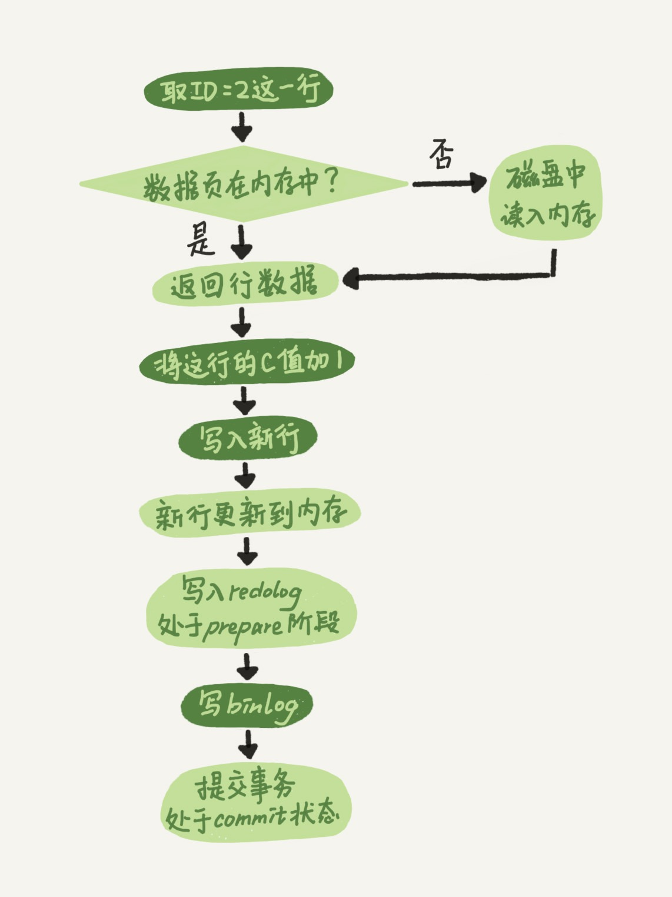

# 2.日志系统：一条SQL更新语句是如何执行的

* 更新语句也会像select语句一样，走一遍流程。连接器、清空查询缓存、分析器、优化器、执行器。
* 和select不同的是，更新涉及两个重要的日志模块：redo log（重做日志）、binlog（归档日志）
* 如果每次跟新都写磁盘，IO的成本会很高。所以MySQL中就有类似于账本（操作耗时）和小黑板（不耗时）的方式来提高效率，这个在MySQL中叫WAL（write ahead Logging）就是先写日志，再写磁盘，也就是先写小黑板，再写账本。
* MySQL更新记录后，先写redo log，并更新内存，在系统空闲时间再刷盘，但是redo log也有一定的大小，当redo log写满的时候就要强制刷盘。这个redo log中有个checkout 的概念，这个一方面可以记录写入redo log的位置，另一方面再系统异常重启的时候，也可以知道从哪里恢复。所以有了redo log，db就有了crash-safe能力。
* redo log是innodb引擎特有的日志，binlog是MySQL server的日志
* 这两个日志的区别：
  * redo log是innodb引擎特有的，binlog是MySQL server层实现的，所有的引擎都可以使用
  * redo log是物理日志，记录某个数据页上做了什么修改，binlog是逻辑日志，记录的是这个语句的逻辑，比如是给某个id的c值加1
  * redo log是循环写入，空间会用完；binlog是追加写，当binlog大小到一定程度会切换到下一个文件。
* update的内部流程：
  * 执行器先找引擎取id=2这一行，id是主键，引擎直接用树搜索这一行，如果在内存中直接返回给执行器，否在从磁盘读入内存，再返回
  * 执行器拿到引擎给的数据进行运算，调用引擎的接口写入新数据
  * 引擎将这行数据更新写入内存，同时将跟新记录到redo log中，此时redo log处于prepare状态。告知执行器完成，随时可以提交事务
  * 执行器生成binlog，写入磁盘
  * 执行器调用引擎提交事务接口，引擎把刚写入的redo log改成commit状态
* 如图：浅色是在引擎中的操作，深色是在执行器中执行

* 有prepare和commit两个状态，这个就是两阶段提交。是为了保证两种日志的逻辑一致。
* 数据的恢复过程：
  * 如果中午12点有次数据误删
  * 那么可以用之前的整库备份恢复到临时库
  * 然后将从备份点开始的binlog一次取出来，重放到中午删除之前就好
* 为什么要使用两阶段提交：
  * 比如update了一条记录，我们假设先写完两个日志之间，数据库crash，看看有问题：
  * 如果先写redo log，系统crash
    * 重启后，恢复数据，但是这个根更新没有记录到binlog中，以后用binlog恢复的时候，就丢失了一个事务，和原数据库不同
  * 如果先写binlog，系统crase
    * 重启后，redo log没有写，这个事务无效，但是已经写到了binlog中，恢复的时候多了一个事务，与原库不一致
* 两阶段提交就是叫两个日志保持逻辑上的一致
* 两个变量
  * innodb_flush_log_at_trx_commit为1时表示每次事务提交redo log都及时之久到磁盘，这个参数可以保证MySQL重启后数据不丢失
  * sync_binlog为1时表示每次事务的binlog都持久到磁盘，保证MySQL异常重启后binlog不丢失。

# 2.sql执行

* 1.首先客户端通过tcp/ip发送一条sql语句到server层的SQL interface

  2.SQL interface接到该请求后，先对该条语句进行解析，验证权限是否匹配

  3.验证通过以后，分析器会对该语句分析,是否语法有错误等

  4.接下来是优化器器生成相应的执行计划，选择最优的执行计划

  5.之后会是执行器根据执行计划执行这条语句。在这一步会去open table,如果该table上有MDL，则等待。

  如果没有，则加在该表上加短暂的MDL(S)

  (如果opend_table太大,表明open_table_cache太小。需要不停的去打开frm文件)

  6.进入到引擎层，首先会去innodb_buffer_pool里的data dictionary(元数据信息)得到表信息

  7.通过元数据信息,去lock info里查出是否会有相关的锁信息，并把这条update语句需要的

  锁信息写入到lock info里(锁这里还有待补充)

  8.然后涉及到的老数据通过快照的方式存储到innodb_buffer_pool里的undo page里,并且记录undo log修改的redo

  (如果data page里有就直接载入到undo page里，如果没有，则需要去磁盘里取出相应page的数据，载入到undo page里)

  9.在innodb_buffer_pool的data page做update操作。并把操作的物理数据页修改记录到redo log buffer里

  由于update这个事务会涉及到多个页面的修改，所以redo log buffer里会记录多条页面的修改信息。

  因为group commit的原因，这次事务所产生的redo log buffer可能会跟随其它事务一同flush并且sync到磁盘上

  10.同时修改的信息，会按照event的格式,记录到binlog_cache中。(这里注意binlog_cache_size是transaction级别的,不是session级别的参数,

  一旦commit之后，dump线程会从binlog_cache里把event主动发送给slave的I/O线程)

  11.之后把这条sql,需要在二级索引上做的修改，写入到change buffer page，等到下次有其他sql需要读取该二级索引时，再去与二级索引做merge

  (随机I/O变为顺序I/O,但是由于现在的磁盘都是SSD,所以对于寻址来说,随机I/O和顺序I/O差距不大)

  12.此时update语句已经完成，需要commit或者rollback。这里讨论commit的情况，并且双1

  13.commit操作，由于存储引擎层与server层之间采用的是内部XA(保证两个事务的一致性,这里主要保证redo log和binlog的原子性),

  所以提交分为prepare阶段与commit阶段

  14.prepare阶段,将事务的xid写入，将binlog_cache里的进行flush以及sync操作(大事务的话这步非常耗时)

  15.commit阶段，由于之前该事务产生的redo log已经sync到磁盘了。所以这步只是在redo log里标记commit

  16.当binlog和redo log都已经落盘以后，如果触发了刷新脏页的操作，先把该脏页复制到doublewrite buffer里，把doublewrite buffer里的刷新到共享表空间，然后才是通过page cleaner线程把脏页写入到磁盘中

