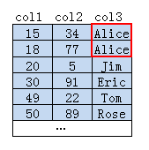
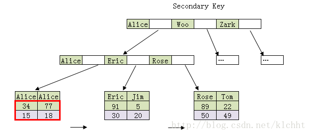
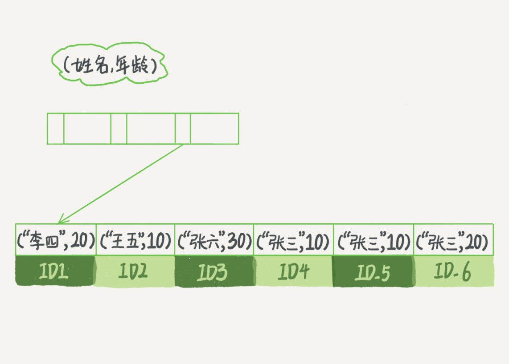
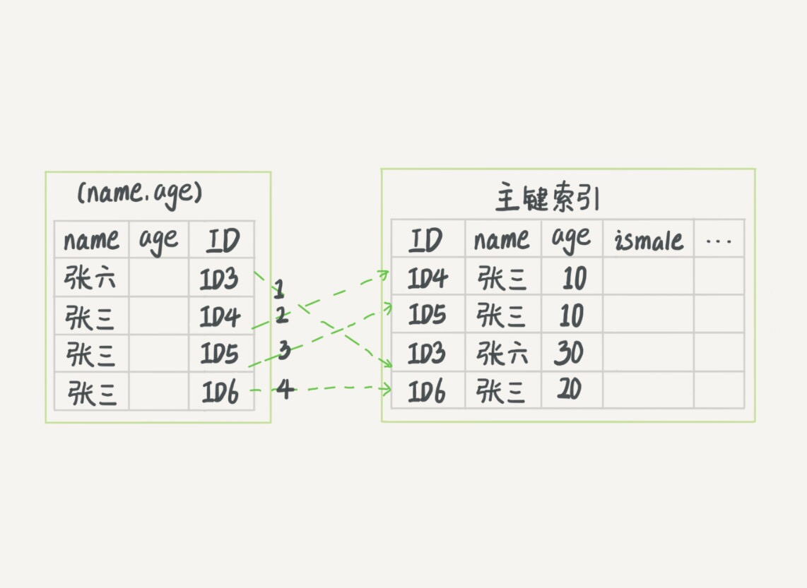
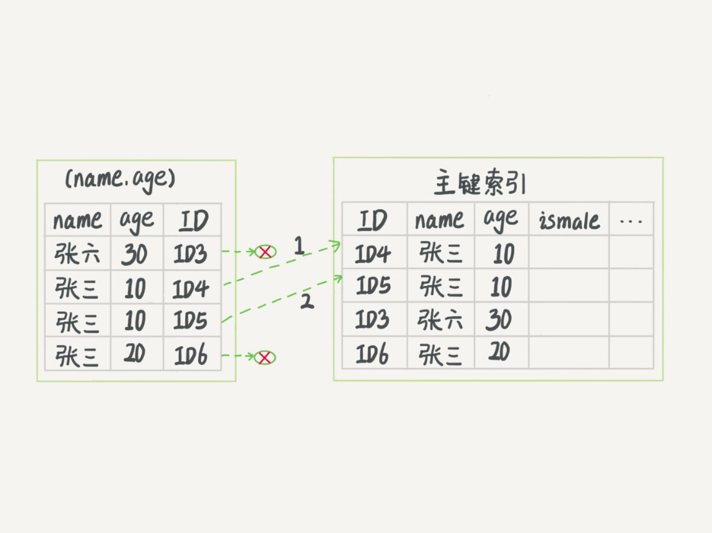

# 4.深入浅出索引

* 索引的目的就是为了提高数据库查询效率，就像书的目录一样。

## 1.常见的索引类型

#### 1.1 可以用于提高读写效率的数据结构有很多，例如：哈希表，有序数据，搜索树

* 哈希表：
  * 是一种key-value存储结构
  * 思路简单，把值放在一个数组里，用哈希函数把key算出一个位置
  * 但是位置可能重复，所以就要拉出一个链表，把相同位置的元素不停的向后追加
  * 要知道一个key的value，就是先通过哈希函数处理key，然后再遍历链表。所以哈希表添加新元素快，只要追加，但是并不一定有序，所以哈希索引区间查询比较慢，要把区间中的所有key扫描一遍。
  * 所以哈希表适合在等值查找中使用
* 有序数组：
  * 在等值查找和范围查找方面都很优秀，可以通过二分查找，快速找到
  * 但是，如果要在中间位置插入数据，代价很高
  * 所以，有序数组适合静态数据，例如2017年某个城市的人口数（不再变化）
* 二叉搜索树：
  * 二叉搜索树的特点是：左儿子节点小于父节点，父节点小于右儿子节点，所以查询的效率是log(N)
  * 但是为了维持这个复杂度，要保证树是平衡二叉树，为了这个保证，更新的时间复杂度也是log(N)
  * 有二叉树，就有N叉树。多叉树，从左到右每个儿子节点大小递增，二叉树搜索效率最高
  * 二叉树虽然搜索小徐最高，但是存储相同节点要的树高最高，在机械磁盘时代，读一个数据块代价很高，为了减少磁盘读取，就要使用N叉树，这里的N取决于数据块的大小。
  * Innodb为例：N为1200左右。树高为4时，1200^3大概是17亿，访问一个10亿行的表上一个整数字段的索引，查找一个值，最多访问3次磁盘。
  * N叉树在读写上的优势，在数据库引擎中使用很多。

#### 1.2Innodb的索引模型

* 索引是在存储引擎层实现的
* innodb的表都是根据主键顺序以索引形式存放的，这种存储方式的表称为索引组织表，innodb使用B+树

索引模型。数据都存在B+树中，每一个索引都有一颗B+树。

* 根据叶子节点的内容，索引分为主键索引和非主键索引
* 主键索引的叶子节点保存整行数据，也被称为聚簇索引，非主键索引的叶子节点保存主键值，也被称作二级索引，非聚簇索引。
* 对于select * from table where k =10;的sql来说，基于非主键索引的查询要多查一棵B+树，先查非主键索引B+树，得到主键，再查主键索引B+树，得到数据
* 索引定位page，page中有个有序数组，通过二分查找定位行数据。

#### 1.3索引维护

* 如果插入数据的主键是递增的，只会在原有记录后边追加数据。
* 如果不是递增，而是在数据中间插入，就要挪动后边的数据，空出位置。
* 如果当数据页满了后，B+树的算法就要申请新的数据页，并且搬迁一部分数据过去，性能受影响，空间利用率也下降。这个是页的分裂。
* 如果有自增主键，就是讲自增列定义在主键上（NOT NULL PRIMARY KEY AUTO_INCREMENT），插入时可以不指定ID，系统自己将ID加1。这种递增插入不会涉及搬迁数据和触发叶子节点分裂。
* 并且，主键长度越小，索引约节省空间。因为非主键索引的叶子节点保存的是主键值。

## 2.一些其他的概念

* 覆盖索引：可以满足查询的索引叫覆盖索引。覆盖索引可以减少树的搜索，显著提升查询性能，所以使用覆盖索引是一个常用的性能优化手段
* 联合索引建立后的B+树结构是，先按照一列排序，再接着按下一列排序，依次完成，第一张图是数据，索引是第二张图，如图：






* 最左前缀原则:

  ```sql
  CREATE TABLE `tuser` (
    `id` int(11) NOT NULL,
    `id_card` varchar(32) DEFAULT NULL,
    `name` varchar(32) DEFAULT NULL,
    `age` int(11) DEFAULT NULL,
    `ismale` tinyint(1) DEFAULT NULL,
    PRIMARY KEY (`id`),
    KEY `id_card` (`id_card`),
    KEY `name_age` (`name`,`age`)
  ) ENGINE=InnoDB
  ```

  * 看到这里你一定有一个疑问，如果为每一种查询都设计一个索引，索引是不是太多了。如果我现在要按照市民的身份证号去查他的家庭地址呢？虽然这个查询需求在业务中出现的概率不高，但总不能让它走全表扫描吧？反过来说，单独为一个不频繁的请求创建一个（身份证号，地址）的索引又感觉有点浪费。应该怎么做呢？这里，我先和你说结论吧。B+ 树这种索引结构，可以利用索引的“最左前缀”，来定位记录。为了直观地说明这个概念，我们用（name，age）这个联合索引来分析。

  

  

  * 可以看到，索引项是按照索引定义里面出现的字段顺序排序的。当你的逻辑需求是查到所有名字是“张三”的人时，可以快速定位到 ID4，然后向后遍历得到所有需要的结果。如果你要查的是所有名字第一个字是“张”的人，你的 SQL 语句的条件是"where name like ‘张 %’"。这时，你也能够用上这个索引，查找到第一个符合条件的记录是 ID3，然后向后遍历，直到不满足条件为止。可以看到，不只是索引的全部定义，只要满足最左前缀，就可以利用索引来加速检索。这个最左前缀可以是联合索引的最左 N 个字段，也可以是字符串索引的最左 M 个字符。
  * 基于上面对最左前缀索引的说明，我们来讨论一个问题：在建立联合索引的时候，如何安排索引内的字段顺序。这里我们的评估标准是，索引的复用能力。因为可以支持最左前缀，所以当已经有了 (a,b) 这个联合索引后，一般就不需要单独在 a 上建立索引了。因此，第一原则是，如果通过调整顺序，可以少维护一个索引，那么这个顺序往往就是需要优先考虑采用的。所以现在你知道了，这段开头的问题里，我们要为高频请求创建 (身份证号，姓名）这个联合索引，并用这个索引支持“根据身份证号查询地址”的需求。那么，如果既有联合查询，又有基于 a、b 各自的查询呢？查询条件里面只有 b 的语句，是无法使用 (a,b) 这个联合索引的，这时候你不得不维护另外一个索引，也就是说你需要同时维护 (a,b)、(b) 这两个索引。
  * 这时候，我们要考虑的原则就是空间了。比如上面这个市民表的情况，name 字段是比 age 字段大的 ，那我就建议你创建一个（name,age) 的联合索引和一个 (age) 的单字段索引。

* 索引下推：

  * 上一段我们说到满足最左前缀原则的时候，最左前缀可以用于在索引中定位记录。这时，你可能要问，那些不符合最左前缀的部分，会怎么样呢？我们还是以市民表的联合索引（name, age）为例。如果现在有一个需求：检索出表中“名字第一个字是张，而且年龄是 10 岁的所有男孩”。那么，SQL 语句是这么写的：

  ```sql
  mysql> select * from tuser where name like '张 %' and age=10 and ismale=1;
  ```

  * 你已经知道了前缀索引规则，所以这个语句在搜索索引树的时候，只能用 “张”，找到第一个满足条件的记录 ID3。当然，这还不错，总比全表扫描要好。然后呢？当然是判断其他条件是否满足。在 MySQL 5.6 之前，只能从 ID3 开始一个个回表。到主键索引上找出数据行，再对比字段值。而 MySQL 5.6 引入的索引下推优化（index condition pushdown)， 可以在索引遍历过程中，对索引中包含的字段先做判断，直接过滤掉不满足条件的记录，减少回表次数。图 1 和图 2，是这两个过程的执行流程图。
  
      

  
  
  * 图 1中，在 (name,age) 索引里面我特意去掉了 age 的值，这个过程 InnoDB 并不会去看 age 的值，只是按顺序把“name 第一个字是’张’”的记录一条条取出来回表。因此，需要回表 4 次。图 2 跟图 1 的区别是，InnoDB 在 (name,age) 索引内部就判断了 age 是否等于 10，对于不等于 10 的记录，直接判断并跳过。在我们的这个例子中，只需要对 ID4、ID5 这两条记录回表取数据判断，就只需要回表 2 次。


## 3.其他

* innodb删除部分数据后，他的索引还在未释放，会占用空间，只有在重建表的时候才会重建索引，所以可以使用alter table table_name engine=InnoDB来重建索引

### 自己的一些问题：

* DB索引里边的N叉树的N可以认为调整吗？
